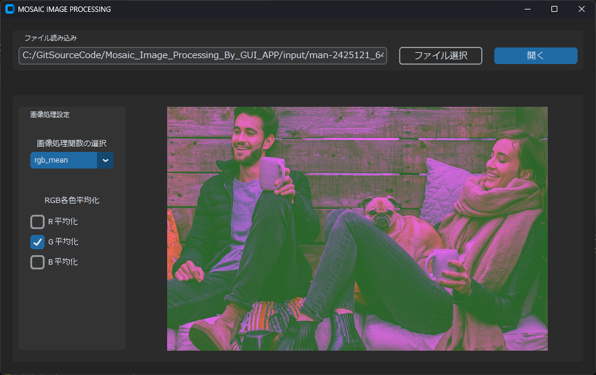
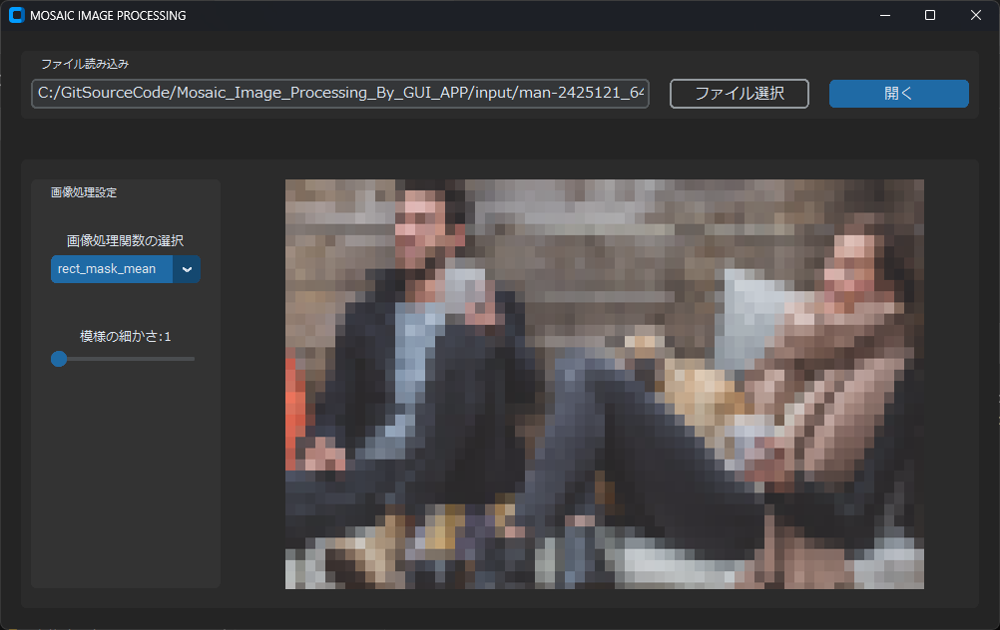
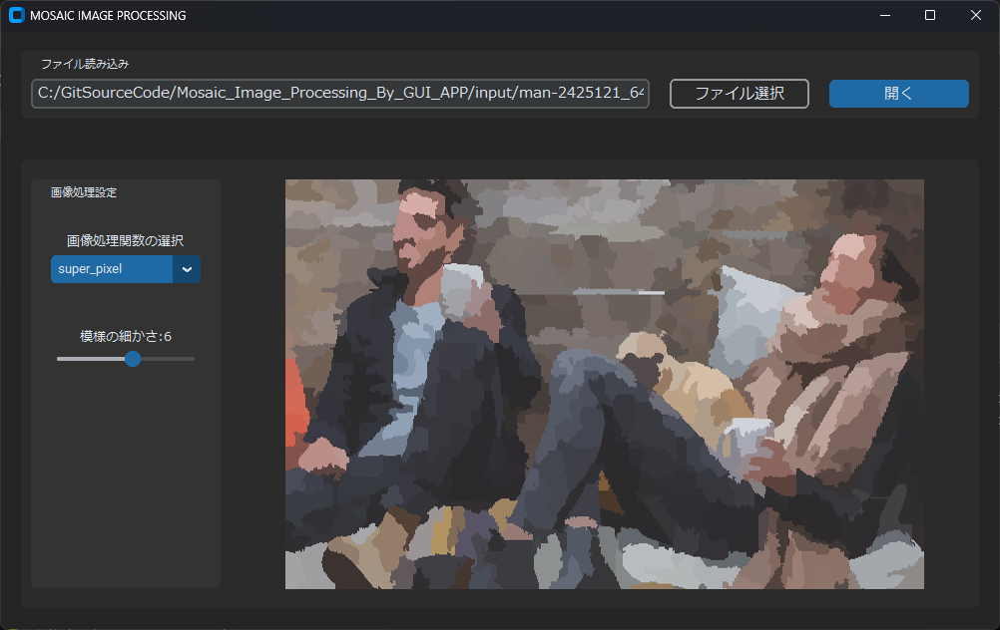

# Mosaic Image Processing By GUI APP

## 目次
1. [概要](#概要)
1. [実行結果](#実行結果)
1. [開発メタデータ](#開発メタデータ)
1. [参考文献/サイト](#参考文献サイト)

## 概要
準備中

## 実行結果
- RGB平均化 

- 三角形モザイク 

- 四角形モザイク 

- 六角形モザイク 

- スーパーピクセルセグメンテーションによるモザイク 

## 開発メタデータ
作成者&emsp;&emsp;&emsp;K.Makita 
開発期間&emsp;&emsp;2023年11月~2023年12月 
公開日&emsp;&emsp;&emsp;2024年06月29日 
最終更新日&emsp;2024年06月29日 

## 参考文献/サイト
- Qiita, CustomTkinter で作るおしゃれな Python GUI & フレームを活用したGUI作成チュートリアル  
https://qiita.com/key353/items/e59927dcf20916f9d4ac  
最終アクセス日 2024年06月29日

- Qiita, OpenCVのスーパーピクセル(2). 分割領域を平均化してみる  
https://qiita.com/sitar-harmonics/items/b94a0f45c3e2389ef6a6  
最終アクセス日 2024年06月29日

- Pixabay  
https://pixabay.com/ja/  
最終アクセス日 2024年06月29日